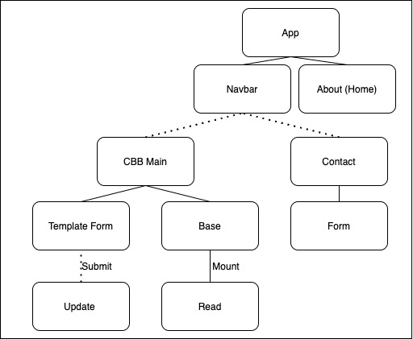

# Project Overview

## Project Name

Cocktail Build Beautifier

## Project Description

This app will provide an opinionated tool for formatting of raw cocktail recipe data; step three in the implementation of a searchable cocktail database.

1. Gather/digitize all recipe data
2. Convert to csv and upload to Airtable 
3. __Standardize format and build JSON database__  
4. Use formatted data to implement searchable database
5. Be able to search for recipes at service speed
6. Profit

## Wireframes

Upload images of your wireframes to an image hosting site or add them to an assets folder in your repo and link them here with a description of each specific wireframe.

## Component Hierarchy

## API and Data Sample

Show us a snippet of JSON returned by your Airtable (you can find it under the API documentation) so we know you can access it and get the info you need. This __must__ be properly formatted. An example is below:

### MVP/PostMVP

The functionality will then be divided into two separate lists: MVP and PostMVP.  Carefully decide what is placed into your MVP, as the client will expect this functionality to be implemented upon project completion.  

#### MVP 

- Build navbar, contact, about components
- Condense airtable into single column format
- Display airtable and beautiful cocktail template form side-by-side
- Implement drag/drop movement from airtable to template form
- Export completed cocktail to JSON 

#### PostMVP  
*These are examples only. Replace with your own Post-MVP features.*

- Add second API
- Use local storage to save user favorites

## Project Schedule

This schedule will be used to keep track of your progress throughout the week and align with our expectations. Here's an example.

|  Day | Deliverable | Status
|---|---| ---|
|July 10-12| Prompt / Wireframes / Priority Matrix / Timeframes | Incomplete
|July 13| Project Approval | Incomplete
|July 13| Core Application Structure (HTML, CSS, etc.) | Incomplete
|July 14| Pseudocode / actual code | Incomplete
|July 15| Initial Clickable Model  | Incomplete
|July 16| MVP | Incomplete
|July 17| Presentations | Incomplete

## Timeframes

Tell us how long you anticipate spending on each area of development. Be sure to consider how many hours a day you plan to be coding and how many days you have available until presentation day.

Time frames are also key in the development cycle.  You have limited time to code all parts of your app.  Your estimates can then be used to evalute possibilities based on time needed and the actual time you have before the app must be submitted. It's always best to pad the time by a few hours so that you account for the unknown so add an additional hour or two to each component to play it safe. Throughout your project, keep track of your Time Invested and Actual Time and update your README regularly.

| Component | Priority | Estimated Time | Time Invested | Actual Time |
| --- | :---: |  :---: | :---: | :---: |
| Adding Form | H | 3hrs| 3.5hrs | 3.5hrs |
| Working with API | H | 3hrs| 2.5hrs | 2.5hrs |
| Total | H | 6hrs| 5hrs | 5hrs |

## SWOT Analysis

### Strengths:

### Weaknesses:

### Opportunities:

### Threats:
